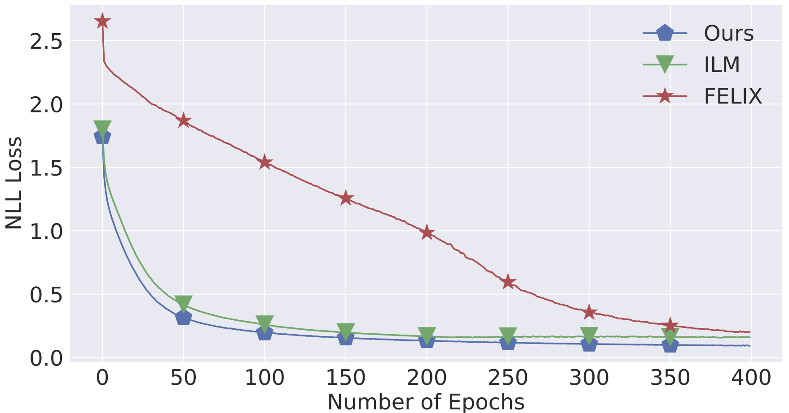
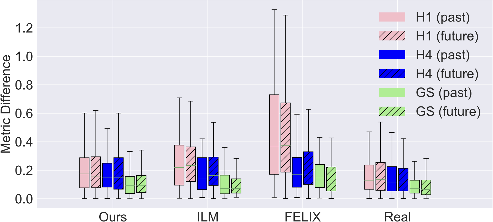
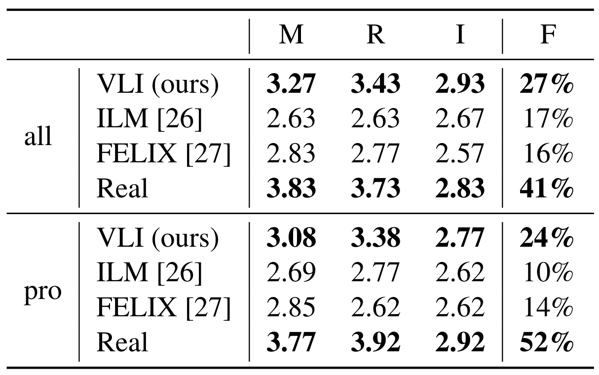

# Variable-Length-Piano-Infilling
The official implementation of Variable-Length Piano Infilling (VLI). (paper: Variable-Length Music Score Infilling via XLNet and Musically Specialized Positional Encoding)

VLI is a new Transformer-based model for music score infilling, i.e., to generate a polyphonic music sequence that fills in the gap between given past and future contexts. Our model can infill a variable number of notes for different time spans. 

## Installation
1. Clone and install the modified [Huggingface Transformer](https://github.com/reichang182/Transformer) package.
2. Clone this repo and install the required packages.

    git clone https://github.com/reichang182/Variable-Length-Piano-Infilling.git
    cd  Variable-Length-Piano-Infilling
    pip install -r requirement.txt
3. Download and unzip the AIlabs.tw Pop1K7 dataset. (Download link: [here](https://drive.google.com/file/d/1qw_tVUntblIg4lW16vbpjLXVndkVtgDe/view?usp=sharing)).

## Training & Testing
	# Prepare data
	python prepare_data.py \
		--midi-folder datasets/midi/midi_synchronized/ \
		--save-folder ./
	
	# Train the model
	python train.py --train

	# Test the trained model
	python train.py

## Architecture

## Results

